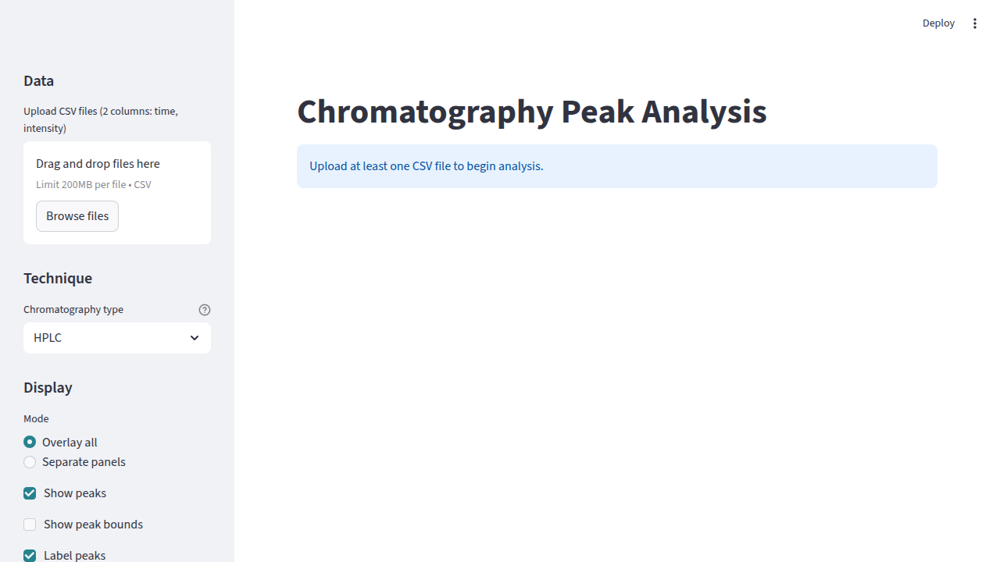
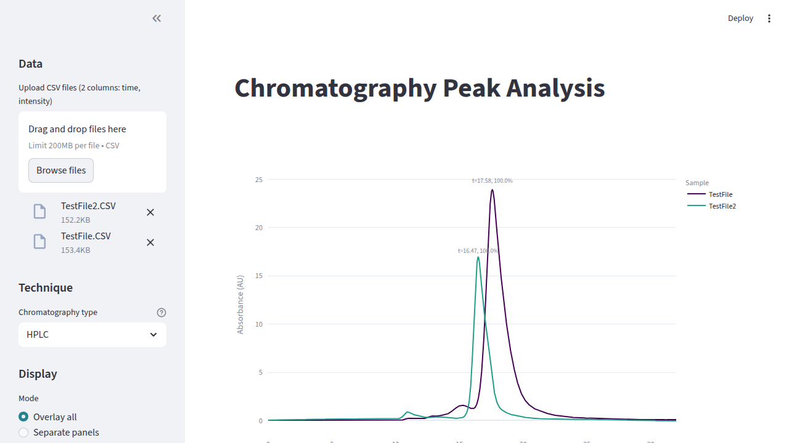
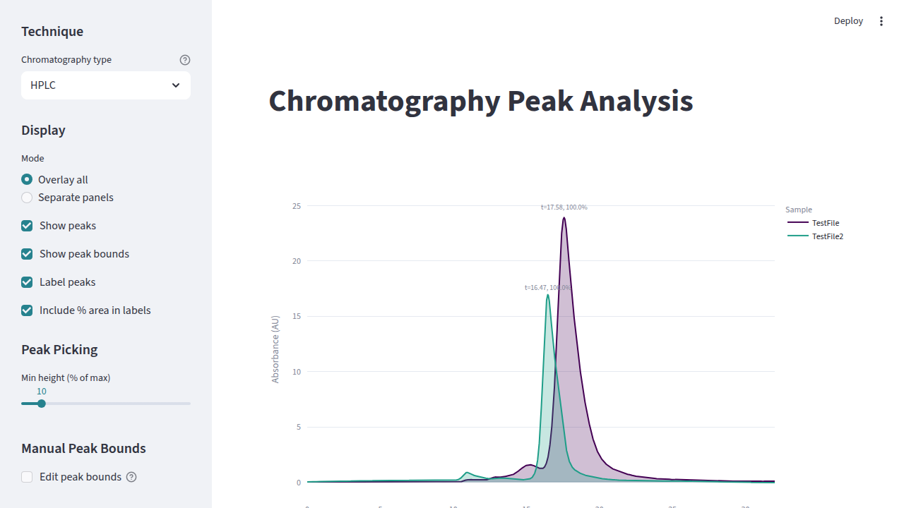
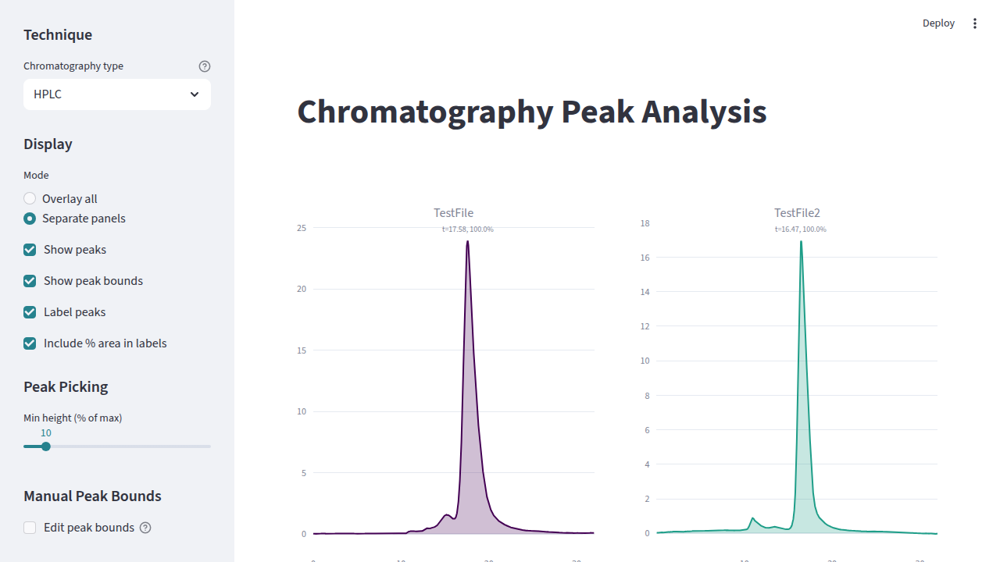

# User Guide

A concise step-by-step guide for the **Chromatography Peak Analysis** app.

---

## Step 1 — Install & Launch

```bash
git clone https://github.com/andrewgrassetti/chromatography_tools.git
cd chromatography_tools
pip install -r requirements.txt
streamlit run app.py
```

A browser window opens automatically. If not, navigate to the URL printed in the terminal (typically `http://localhost:8501`).

You will see the landing page with the sidebar controls on the left and a prompt to upload data on the right:



---

## Step 2 — Load Your Data

To load data, paste the full path to the folder containing your sample subfolders in the **Data directory (local path)** text input in the sidebar. The app recursively finds DAD1A CSV files and automatically labels each one with the AB number extracted from its parent folder name.

For example, pasting `/Users/you/Data/20260424 151551SYSTEM (SYSTEM)AB628` will detect the AB number `AB628` and load all DAD1A CSV files found inside.

> **Tip:** Two demo files (`TestFile.CSV`, `TestFile2.CSV`) are included in the `tests/` folder for quick testing.

---

## Step 3 — Select a Chromatography Technique

Under **Technique** in the sidebar, choose the chromatography type from the dropdown:

| Technique | Use Case |
|---|---|
| **HPLC** | UV/Vis absorbance detection (default) |
| **GC** | Gas chromatography — FID/TCD (sharper peaks) |
| **SEC/GPC** | Size-exclusion / gel permeation chromatography |
| **Ion Chromatography** | Conductivity detection (broader peaks) |

Each technique applies optimized defaults for smoothing window size, axis labels, and peak detection thresholds.

---

## Step 4 — View Your Chromatograms

After uploading, the chromatogram plot is displayed in the main area with automatic peak detection, labels, and percentage areas:



### Display Options (sidebar → Display)

- **Mode**: Choose **Overlay all** (all traces on one plot) or **Separate panels** (one panel per file).
- **Show peaks**: Toggle peak markers on/off.
- **Show peak bounds**: Display shaded integration regions under each peak.
- **Label peaks**: Show retention time labels above each peak.
- **Include % area in labels**: Append relative area percentages to labels.

---

## Step 5 — Adjust Peak Detection

Use the **Min height (% of max)** slider under **Peak Picking** in the sidebar to control the sensitivity of peak detection. Lower values detect smaller peaks; higher values filter out noise.

---

## Step 6 — Show Peak Bounds

Check **Show peak bounds** in the sidebar to visualize the integration regions as shaded areas beneath each detected peak:



---

## Step 7 — Use Separate Panels

When comparing multiple files, switch to **Separate panels** mode for side-by-side viewing:


---

## Step 8 — Set Nicknames

Scroll to the **Nicknames** section at the bottom of the sidebar to give each uploaded file a custom display name. The nickname is used in the plot legend and summary table.

---

## Step 9 — Manually Edit Peak Bounds

For fine-grained control over integration regions:

1. Check **Edit peak bounds** under **Manual Peak Bounds** in the sidebar.
2. Click on the plot to the **left** of a peak's apex to set the left integration bound.
3. Click to the **right** of a peak's apex to set the right integration bound.
4. Active overrides appear in the sidebar under **Active Bound Overrides**, where you can remove individual overrides (✕) or **Clear all overrides**.

---

## Step 10 — Review the Peak Summary

Below the plot, a **Peak Summary** table is displayed with one row per file, including:

- Filename & nickname
- Chromatography technique
- Total number of detected peaks
- Per-peak retention times and relative areas (%)



---

## Step 11 — Export Results

### Download Summary CSV
Click **Download summary CSV** below the summary table to save peak data as a CSV file.

### Download Plot Image
1. In the sidebar under **Export**, select the desired format (**PNG**, **SVG**, or **PDF**) and set the image dimensions.
2. Click **Download plot (PNG/SVG/PDF)** below the chart, then click the **Save** button that appears.

---

## Sidebar Reference

All controls are organized in the sidebar for easy access:


| Section | Controls |
|---|---|
| **Data** | File upload (drag-and-drop or browse) |
| **Technique** | Chromatography type dropdown |
| **Display** | Overlay/Separate mode, peak visibility toggles |
| **Peak Picking** | Min height threshold slider |
| **Manual Peak Bounds** | Enable click-to-set integration bounds |
| **Export** | Plot format, width, and height |
| **Nicknames** | Custom display names per file |
